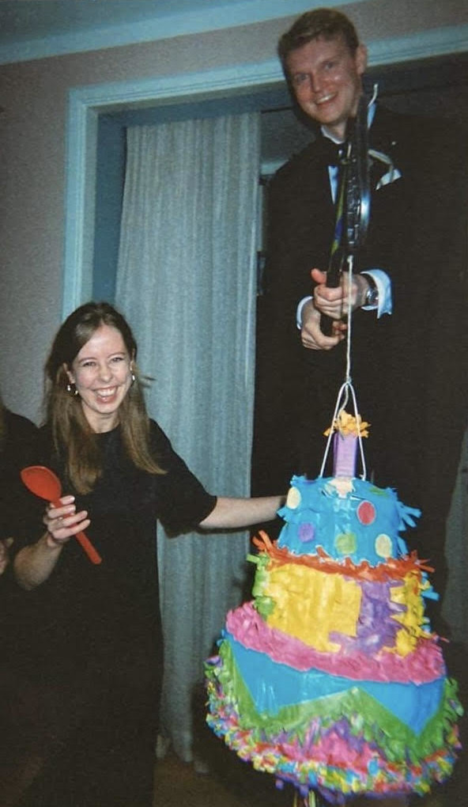
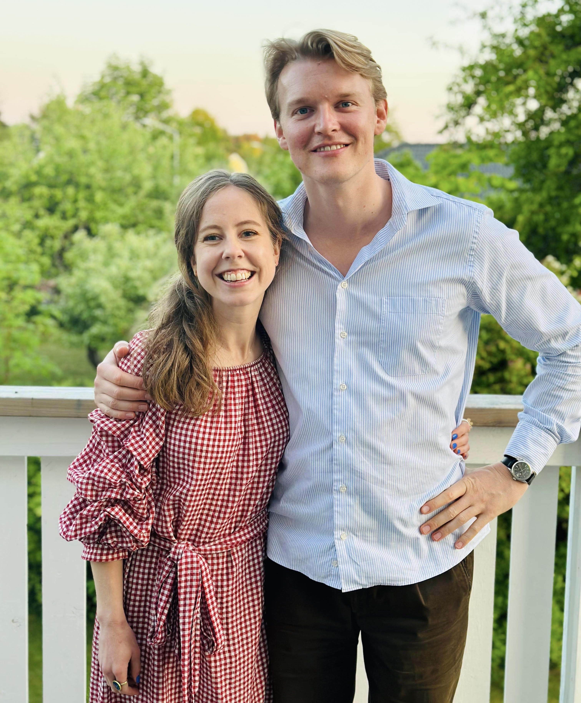

<h1> 🎊 OSA 🎊 </h1>

 Tryck ✨<a target="_blank" href="https://docs.google.com/forms/d/e/1FAIpQLScMqCB3ZLbIoSALHixe6yPg6gWMIBRdzEmGZ4ZQRpRTduqffg/viewform?usp=sf_link">HÄR</a>✨

<h2> Bra att veta </h2>

<ul> 
<li> Längdskidor och långfärdsskridskor är kul oavsett status total nybörjare eller Jakob (Cederlöf) Bourne </li>
<li> Deadline för att OSA är 31/10</li>
<li> Ni bokar boende själva, se sektion <a style="color:black" href="/boende">Boende</a> </li>
<li> Vi står för lördagskalaset, övriga måltider etc. står vi inte för då våra fickor (ännu) inte är tillräckligt djupa </li>
</ul>

  
  

