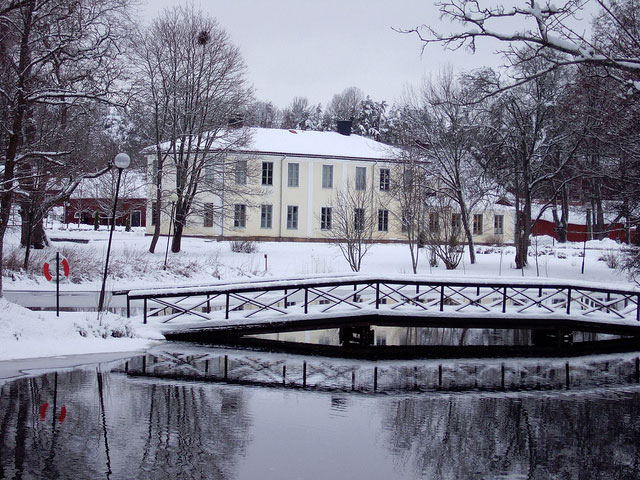

<h1> Boende </h1>

Ni bokar boende själva! Nedan är förslag och vi har prelbokat till er men boka asap då vi ej kan hogga rummen för evigt

<h2> 🏰 Högbo Bruk </h2>

Så himla trevligt och svingod mat (ink frukosten). Det ska finnas tillräckligt med rum reserverade för fredag och lördag natt, torsdag natt har vi bara några rum reserverade så först till kvarn att haffa om ni vill bo fr.o.m torsdag

**Pris:**: 1995 per natt per dubbelrum

**Avstånd**: Högbo Kyrka ~500 m, festlokal Nya Herrgården ~500 m

**Boka:** XXX, ange "ingridochmagnus" som kod

<h2> 🏫 Högbo Vandrarhem </h2>

Högbos gamla byskola som är vandrarhem sedan över 20 år. Ägarna verkar trevliga och det är riktigt billiga rum, men inget annat ingår och oklart hur nice de gemensamma utrymmena är

**Pris:** 240-290 SEK beroende på antal bäddar i rummet

**Avstånd**: Högbo Kyrka ~100 m, festlokal Nya Herrgården ~500 m

**Boka:**<a target="_blank" href="https://www.hogbovandrarhem.com/"> Länk</a> till deras hemsida, ange "Ingrid och Magnus bröllop" när ni bokar så vi kan organisera rummen vid behov
